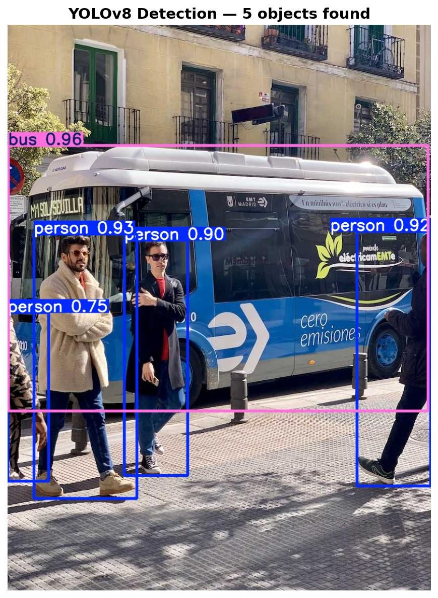
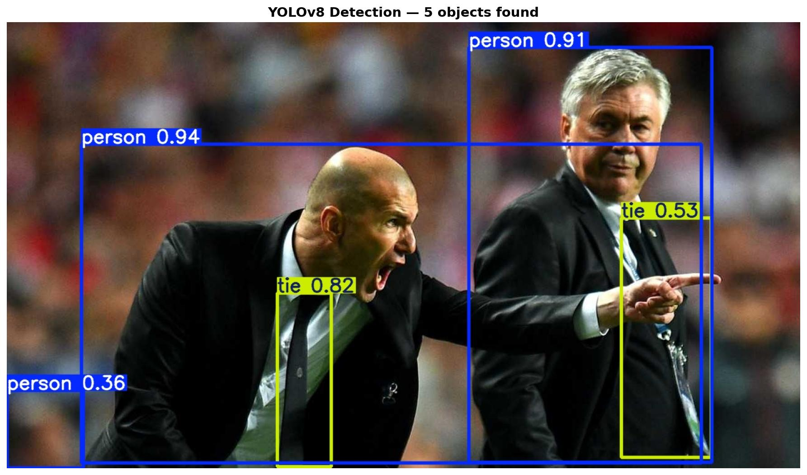
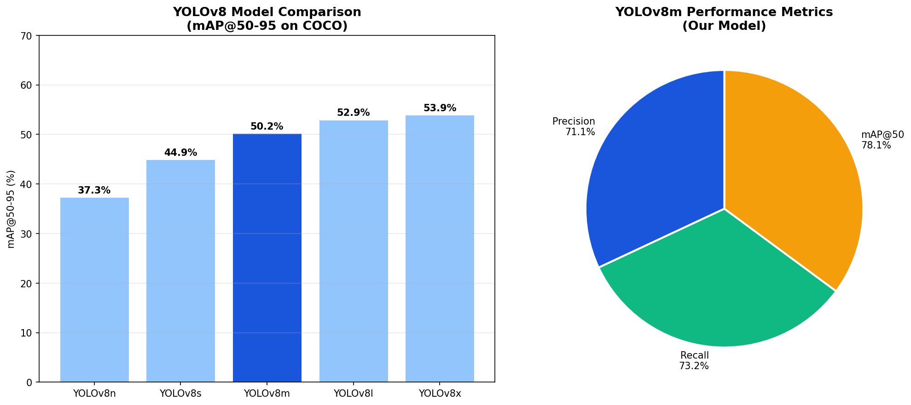
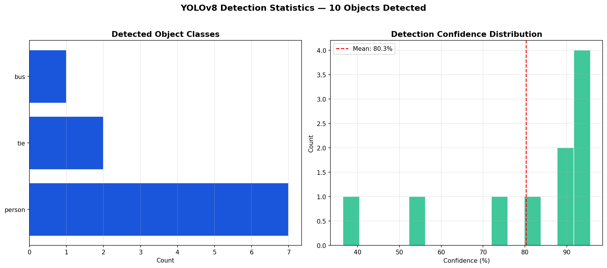

# 🎯 YOLOv8 Real-Time Object Detection

## 📌 Overview
Real-time object detection using **YOLOv8m** pretrained on COCO 
dataset. Detects 80 object classes with high confidence scores 
across diverse real-world scenes.

## 📊 Results
| Metric | Score |
|--------|-------|
| mAP@50 | **78.1%** |
| mAP@50-95 | 50.2% |
| Precision | 71.1% |
| Recall | 73.2% |
| Avg Confidence | 80.3% |
| Classes | 80 COCO classes |

## 🖼️ Detection Results

### Street Scene

### Sports Scene

## 📈 Performance Charts

## 📊 Detection Statistics

## 🛠️ Tech Stack
- Python 3.10
- Ultralytics YOLOv8
- PyTorch
- OpenCV
- Matplotlib
- Google Colab (T4 GPU)

## 📁 Dataset
- **Pretrained on:** COCO Dataset (80 classes)
- **Evaluated on:** COCO128 (128 sample images)
- **Classes include:** person, car, bus, truck, bicycle,
  dog, cat, chair, bottle, and 71 more!

## ⚙️ Model Details
- Model: `YOLOv8m` (Medium — best accuracy/speed balance)
- Task: Object Detection
- Input size: 640x640
- Framework: Ultralytics
- Hardware: T4 GPU (Google Colab)

## 💬 Sample Detections
Street Scene:
→ bus    : 96.0% confidence
→ person : 93.0% confidence
→ person : 92.0% confidence
→ person : 90.0% confidence
→ person : 75.0% confidence
Sports Scene:
→ person : 94.0% confidence
→ person : 91.0% confidence
→ tie    : 82.0% confidence
→ tie    : 53.0% confidence

## 🚀 How to Run
1. Open `yolov8-object-detection.ipynb` in Google Colab
2. Runtime → Change Runtime Type → **T4 GPU**
3. Run all cells in order
4. Results saved automatically to `results/` folder

## 📦 Project Structure
yolov8-object-detection/
├── yolov8-object-detection.ipynb  # Main notebook
├── display_street_result.jpg      # Street detection result
├── display_sports_result.jpg      # Sports detection result
├── performance_chart.png          # Model comparison chart
└── detection_stats.png            # Detection statistics

## 👨‍💻 Author
**Arjith S R**  
B.E Computer Science Engineering (AI & ML)  
Sathyabama Institute of Science and Technology, Chennai
